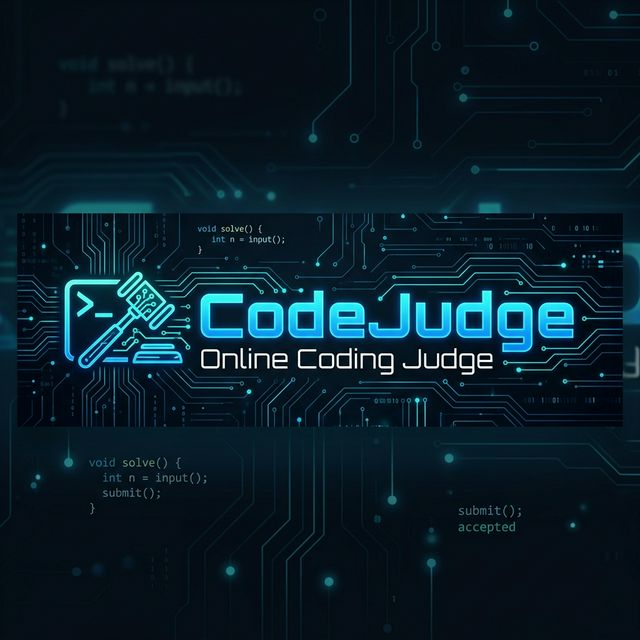
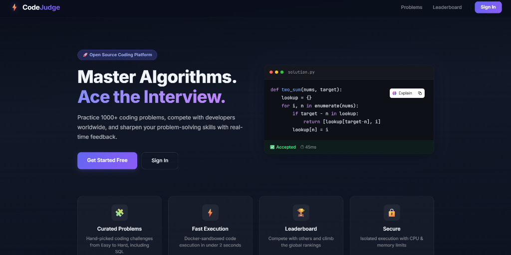

<p align="center">
  
</p>

<h1 align="center">⚖️ CodeJudge — Online Coding Judge</h1>

<p align="center">
  A production-grade, full-stack competitive programming platform with <strong>sandboxed code execution</strong>, real-time feedback, and a comprehensive problem library.
</p>

<p align="center">
  
</p>

<p align="center">
  
  
  
  
  
  
  
</p>

---

## ✨ Features

| Category | Feature |
|---|---|
| 🧑‍💻 **Code Editor** | Monaco Editor (VS Code engine) with syntax highlighting, IntelliSense, and theme support |
| 🐳 **Sandboxed Execution** | Isolated Docker containers for C++, Java, Python, and JavaScript |
| ⚡ **Job Queue** | BullMQ + Redis for async, fault-tolerant submission processing |
| 🔐 **Authentication** | JWT-based auth with role-based access control (Admin / User) |
| 📊 **Leaderboard** | Real-time leaderboard with solve counts and user statistics |
| 🧩 **Problem Library** | 150+ Hard DSA problems + 10 SQL challenges, seeded automatically |
| 🌐 **WebSocket** | Real-time submission verdict push via WebSocket |
| 🛡️ **Admin Panel** | CRUD operations for managing problems |
| 🎨 **Dark Theme** | Premium high-contrast dark UI across the entire platform |

---

## 🏗️ Architecture

```
┌─────────────────────────────────────────────────────┐
│                  Nginx Reverse Proxy (:80)           │
│            ┌──────────────┬──────────────┐           │
│            │    /         │   /api  /ws  │           │
└────────────┼──────────────┼──────────────┼───────────┘
             ▼              ▼              │
   ┌─────────────────┐ ┌─────────────────┐ │
   │  Angular :4200   │ │  Hono.js :3000  │◄┘
   │  (Frontend)      │ │  (Backend API)  │
   │                  │ │                 │
   │  • Home          │ │  • Auth         │
   │  • Problems      │ │  • Problems     │
   │  • Dashboard     │ │  • Submissions  │
   │  • Leaderboard   │ │  • Leaderboard  │
   │  • Admin Panel   │ │  • Admin CRUD   │
   │  • Monaco Editor │ │  • WebSocket    │
   └─────────────────┘ └────────┬────────┘
                                │
                    ┌───────────┼───────────┐
                    ▼           ▼           ▼
             ┌───────────┐ ┌────────┐ ┌──────────────┐
             │  MySQL     │ │ Redis  │ │  BullMQ      │
             │  (Prisma)  │ │ :6379  │ │  Worker      │
             │  :3306     │ └────────┘ └──────┬───────┘
             └───────────┘                    │
                                              ▼
                                   ┌─────────────────────┐
                                   │  Docker Containers   │
                                   │                     │
                                   │  🐍 Python 3.10     │
                                   │  ☕ Java 17         │
                                   │  ⚙️ GCC (C++)       │
                                   │  📦 Node 18 (JS)    │
                                   └─────────────────────┘
```

---

## 🛠️ Tech Stack

### Backend
| Technology | Purpose |
|---|---|
| [Hono.js](https://hono.dev/) | Ultrafast web framework for the REST API |
| [Prisma](https://www.prisma.io/) | Type-safe ORM for MySQL |
| [BullMQ](https://bullmq.io/) | Redis-backed job queue for submission processing |
| [Dockerode](https://github.com/apocas/dockerode) | Programmatic Docker control for sandboxed execution |
| [Zod](https://zod.dev/) | Runtime schema validation |
| [JSON Web Token](https://jwt.io/) | Stateless authentication |
| [WebSocket (ws)](https://github.com/websockets/ws) | Real-time verdict delivery |

### Frontend
| Technology | Purpose |
|---|---|
| [Angular 21](https://angular.dev/) | Component-based SPA framework |
| [Monaco Editor](https://microsoft.github.io/monaco-editor/) | VS Code–powered code editor |
| [RxJS](https://rxjs.dev/) | Reactive data flow |

### Infrastructure
| Technology | Purpose |
|---|---|
| [Docker](https://www.docker.com/) | Sandboxed code execution containers |
| [Redis](https://redis.io/) | In-memory datastore for BullMQ |
| [Nginx](https://nginx.org/) | Reverse proxy & load balancer |
| [MySQL](https://www.mysql.com/) | Relational database (via XAMPP) |

---

## 🚀 Quick Start

### Prerequisites

- **Node.js** v18+ and npm
- **XAMPP** with MySQL running on `localhost:3306`
- **Docker Desktop** (for sandboxed code execution)

### 1. Clone & Configure

```bash
git clone https://github.com/your-username/online-coding-judge.git
cd "Online Coding Judge"
```

Copy the root `.env` file and adjust values if needed:

```env
DATABASE_URL="mysql://root:@localhost:3306/online_judge"
JWT_SECRET="your-secret-key"
REDIS_HOST="localhost"
REDIS_PORT=6379
PORT=3000
```

### 2. Backend

```bash
cd backend
npm install
npx prisma generate
npx prisma db push
npx tsx prisma/seed.ts       # Seeds demo accounts + 150+ problems
npm run dev                  # ➜ http://localhost:3000
```

### 3. Frontend

```bash
cd frontend
npm install
npx ng serve                 # ➜ http://localhost:4200
```

### 4. Redis (Job Queue)

```bash
# From project root
docker-compose up redis      # ➜ Redis on port 6379
```

### 5. Docker Images (Execution Runtimes)

```bash
docker pull python:3.10-slim
docker pull gcc:latest
docker pull openjdk:17-slim
docker pull node:18-slim
```

### 6. Nginx (Optional — Production Proxy)

```bash
docker-compose up nginx      # ➜ http://localhost
```

---

## 🔑 Demo Accounts

| Role | Email | Password |
|---|---|---|
| 🛡️ Admin | `admin@codejudge.com` | `admin123` |
| 👤 User | `john@codejudge.com` | `user123` |
| 👤 User | `jane@codejudge.com` | `user123` |
| 👤 User | `alice@codejudge.com` | `user123` |

---

## 📡 API Reference

### Authentication

| Method | Endpoint | Auth | Description |
|---|---|---|---|
| `POST` | `/api/auth/register` | Public | Register a new user |
| `POST` | `/api/auth/login` | Public | Login and receive JWT |
| `GET` | `/api/auth/me` | Bearer | Get current user profile |

### Problems

| Method | Endpoint | Auth | Description |
|---|---|---|---|
| `GET` | `/api/problems` | Public | List all problems |
| `GET` | `/api/problems/:id` | Public | Get problem by ID |
| `POST` | `/api/problems` | Admin | Create a new problem |
| `PUT` | `/api/problems/:id` | Admin | Update a problem |
| `DELETE` | `/api/problems/:id` | Admin | Delete a problem |

### Submissions

| Method | Endpoint | Auth | Description |
|---|---|---|---|
| `POST` | `/api/submissions/submit` | Bearer | Submit a solution for judging |
| `POST` | `/api/submissions/run` | Bearer | Run against sample test cases |
| `GET` | `/api/submissions/:id` | Bearer | Get submission details |

### Leaderboard

| Method | Endpoint | Auth | Description |
|---|---|---|---|
| `GET` | `/api/leaderboard` | Public | Get global leaderboard |
| `GET` | `/api/leaderboard/stats` | Bearer | Get personal statistics |

---

## 📁 Project Structure

```
Online Coding Judge/
├── backend/                    # Hono.js REST API
│   ├── prisma/
│   │   ├── schema.prisma       # Database schema (User, Problem, Submission)
│   │   ├── seed.ts             # Seed script for demo data
│   │   └── problems/           # 150+ problem definitions
│   └── src/
│       ├── index.ts            # Server entrypoint
│       ├── config/             # Environment & database config
│       ├── controllers/        # Route handlers
│       ├── middleware/         # Auth & validation middleware
│       ├── routes/             # API route definitions
│       ├── services/           # Business logic layer
│       ├── types/              # TypeScript type definitions
│       ├── utils/              # Helper utilities
│       └── workers/            # BullMQ submission worker
│
├── frontend/                   # Angular 21 SPA
│   └── src/app/
│       ├── core/               # Guards, interceptors, services
│       └── features/
│           ├── home/           # Landing page
│           ├── auth/           # Login & registration
│           ├── problems/       # Problem list & editor view
│           ├── dashboard/      # User dashboard
│           ├── leaderboard/    # Rankings table
│           └── admin/          # Problem management
│
├── execution/                  # Docker runtime images
│   ├── Dockerfile.cpp
│   ├── Dockerfile.java
│   ├── Dockerfile.javascript
│   └── Dockerfile.python
│
├── nginx/
│   └── nginx.conf              # Reverse proxy configuration
│
├── docker-compose.yml          # Redis + Nginx services
├── .env                        # Environment variables
├── SETUP.md                    # Detailed setup instructions
└── README.md                   # ← You are here
```

---

## ⚙️ How Code Execution Works

```
1. User submits code via Monaco Editor
              ↓
2. Backend validates & enqueues job (BullMQ → Redis)
              ↓
3. Worker picks up job, spins up a Docker container
   matching the selected language
              ↓
4. Code runs in an isolated sandbox with limits:
   • Timeout:  10 seconds
   • Memory:   256 MB
   • CPU:      1 core
              ↓
5. Output compared against expected test cases
              ↓
6. Verdict pushed to client via WebSocket
   (Accepted / Wrong Answer / TLE / MLE / Runtime Error)
```

---

## 🔒 Security

- **Sandboxed Execution** — All user code runs inside ephemeral Docker containers with strict resource limits
- **JWT Authentication** — Stateless, secure token-based auth with configurable expiry
- **Role-Based Access** — Admin-only endpoints for problem management
- **Input Validation** — Zod schema validation on all API inputs
- **Rate Limiting** — Nginx-level request throttling

---

## 📜 License

This project is licensed under the **MIT License**. See [LICENSE](LICENSE) for details.

---

<p align="center">
  Built with ❤️ for competitive programmers
</p>
